<p align="center">
  
</p>

<div align="center">
  
</div>

---

## 📊 Quick Overview

| **Category** | **Details** |
|--------------|-------------|
| 🎯 **Current Focus** | Full-stack development & game creation |
| 🌱 **Learning** | Advanced system design & AI integration |
| 🔥 **Status** | Contributing to open source daily |
| 🤝 **Collaboration** | Always open to interesting projects |
| 📍 **Specialties** | Web Development, Game Development, DevOps |

---

## 🛠️ Technical Stack Matrix

### 💻 Programming Languages
| **Category** | **Technologies** |
|--------------|------------------|
| **Core Languages** |     |
| **Web Languages** |      |
| **Scripting & Others** |      |

### 🧰 Frameworks & Libraries
| **Category** | **Technologies** |
|--------------|------------------|
| **Frontend Frameworks** |    |
| **Backend Frameworks** |      |
| **Styling & UI** |   |

### 🖥️ Operating Systems & Environment
| **Category** | **Technologies** |
|--------------|------------------|
| **Linux Distributions** |     |
| **Other Systems** |  |
| **Desktop Environments** |   |

### 🗄️ Databases & Cloud Services
| **Category** | **Technologies** |
|--------------|------------------|
| **Relational Databases** |    |
| **NoSQL & Caching** |   |
| **Cloud Platforms** |    |

### 💻 DevOps & Development Tools
| **Category** | **Technologies** |
|--------------|------------------|
| **Containerization** |   |
| **CI/CD & Automation** |     |
| **Build & Package Tools** |    |

### 🎮 Game Development & Creative Tools
| **Category** | **Technologies** |
|--------------|------------------|
| **Game Engines** |    |
| **3D & Design Tools** |    |
| **Image & Graphics** |    |
| **Publishing Platform** |  |

---

## 📈 GitHub Analytics Dashboard

<div align="center">
  
</div>

| **Stats Overview** | **Language Distribution** |
|-------------------|---------------------------|
|  |  |

<div align="center">
  
</div>

---

## 🎯 Current Projects & Focus Areas

### 🚀 Active Development

```mermaid
graph TD
    A[🎮 Game Development] --> B[Unity Projects]
    A --> C[Godot Experiments]
    
    D[💻 Full-Stack Apps] --> E[React/Vue Frontends]
    D --> F[.NET/Node Backends]
    
    G[🔧 DevOps Tools] --> H[Docker Containers]
    G --> I[CI/CD Pipelines]
    
    J[🎨 Creative Projects] --> K[Art + Code Integration]
    J --> L[Interactive Experiences]
```


### 📊 Project Categories
| **Category** | **Description** | **Status** |
|--------------|-----------------|------------|
| 🎮 **Game Development** | Creating immersive experiences with Unity & Godot | 🟢 Active |
| 💻 **Full-Stack Applications** | Building scalable web solutions | 🟢 Active |
| 🔧 **Open Source Tools** | Contributing to the developer community | 🟡 Ongoing |
| 🎨 **Creative Tech Projects** | Blending art with code | 🟢 Active |

---

## 🏆 Achievements & Milestones

<div align="center">
  
</div>

### 📋 Key Accomplishments
- [x] **Active GitHub Contributor** - Consistent commits and project maintenance
- [x] **Published Game Developer** - Projects available on itch.io
- [x] **Full-Stack Proficiency** - Multiple technology stacks mastered
- [x] **DevOps Experience** - Containerization and CI/CD implementation
- [x] **Creative Technologist** - Successfully bridging art and code

---

## 📊 Repository Overview

### 📈 Activity Summary
```text
🔥 Daily Commits: Active contributor
🎯 Current Focus: Full-stack & game development  
📚 Learning Path: AI integration & system design
🤝 Open for: Collaboration on interesting projects
```

### 🎨 Featured Technologies Flow
```
Frontend Development
├── React.js → Component-based UI
├── Vue.js → Progressive framework
└── TailwindCSS → Utility-first styling

Backend Development
├── .NET → Enterprise applications
├── Node.js → JavaScript runtime
└── Express.js → Web framework

Database Layer
├── MySQL → Relational data
├── PostgreSQL → Advanced SQL
├── MongoDB → Document storage
└── Redis → Caching & sessions

DevOps Pipeline
├── Docker → Containerization
├── Kubernetes → Orchestration
└── CI/CD → Automated deployment
```

---

<div align="center">
  
  <br>
  
  <br>
  
  ## 🌟 Thanks for Visiting!
  
  **Let's build something amazing together! 🚀**
  
  
</div>
